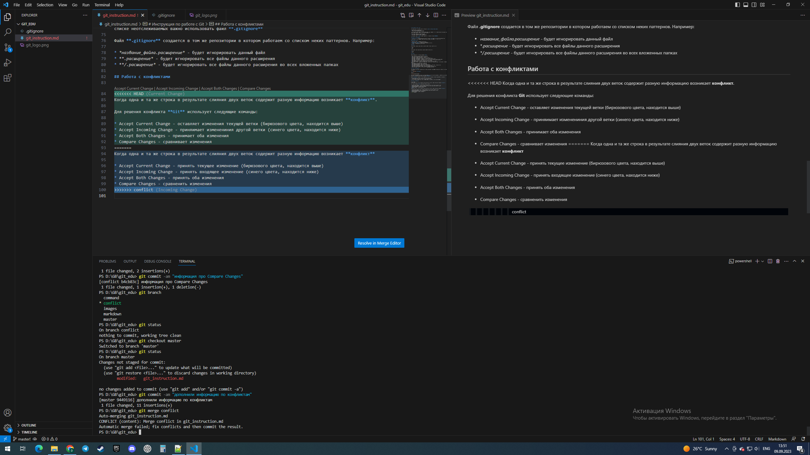

# Инструкция по работе с Git

Для начала работы с Git нужно скачать и установить **Git** и **Visual Studio Code**:

* https://git-scm.com/downloads
* https://code.visualstudio.com/Download

После установки следует запустить Virtual Studio Code, выбрать папку в которой создадите файл для дальнейшей работы.
Также следует указать свое имя и адрес электронной почты:

* git config --global user.name "User Name"
* git config --global user.email "user@mail.com"

Перед началом работы с **Git** следует ознакомиться с синтаксисом языка **MARKDOWN**

## Синтаксис языка Markdown

* **# Заголовок** - выделение заголовка. Количество символов **#** задает уровень заголовка (подзаголовка)
* Чтобы начать с нового абзаца, следует дважды нажать ENTER, иначе запишется с той же строки

### Выделение текста

* *text* или _text_ - выделение текста курсивом
* **text** или __text__ - выделение текста полужирным
* ***text*** или _**text**_ - выделение текста полужирным курсивом
* ~~text~~ - выделение зачеркнутого текста

### Списки

Чтобы добавить ненумерованные списки, необходимо пункты выделить звездочкой (*):

* Один
* Два
* Три

Чтобы добавить нумерованные списки, необходимо пункты пронумеровать:

1. Один
2. Два
3. Три

## Команды

Теперь познакомимся с основными командами **Git**:

* *git --version* - проверка установки и версии Git
* *git init* - инициализация локального репозитория
* *git status* - получить информацию о текущем состоянии
* *git add* - добавляем файлу версионность в локальном репозитории 
* *git commit -m "message"* - создание коммита (сохранения) и заметки к нему
* *git commit -am "message"* - добавление версионности и коммита с заметкой к уже имеющемуся файлу
* *git log* - вывод на экран истории всех коммитов с их хеш-кодами в хронологическом порядке
* *git checkout* - переходот между различными коммитами и ветками
* *git checkout master* - вернуться к актуальному состоянию и продолжить работу
* *git diff* - увидеть разницу между текущим файлом и закомиченным (добавленные файлы отмечены знаком +, удаленные знаком -)
* *git branch* - вывод списка веток в репозитории
* *git branch branch_name* - создать новую ветку
* *git checkout branch_name* - перейти на выбранную ветку
* *git merge branch_name* - добавить (слить) в текущую ветку всю информацию с выбранной ветки
* *git branch -d branch_name* - удалить уже слитую (merged) ветку
* *git branch -D branch_name* - удалить ветку без сохранения информации на ней
* *git log --graph* - посмотреть лог коммитов с визуализацией между ними

* *git clone* - создание копии (клона) удаленного репозитория. В качестве параметра передается URL-адрес репозитория
* *git push* - загрузка содержимого локального репозитория в удаленный репозиторий (Git должен знать адрес удаленного репозитория, также Git должен быть "авторизован" на внесение изменений в удаленном репозитории)
* *git pull* - выкачивание и загрузка данных из удаленного репозитория и обновление локального репозитория в соответствии с этим содержимым

## Работа с изображениями

Для добавления изображения следует поместить нужное изображение в нашу папку и использовать следующую конструкцию (без пробелов):

**! [image_name] (file_name)**

Например:

Для работы с изображениями и некоторыми другими файлами, которые вы не хотите добавлять в репозиторий, и не видеть в списке неотслеживаемых важно использовать файл **.gitignore**

Файл **.gitignore** создается в том же репозитории в котором работаем со списком неких паттернов. Например:

* *название_файла.расширение* - будет игнорировать данный файл
* **.расширение* - будет игнорировать все файлы данного расширения
* **/.расширение* - будет игнорировать все файлы данного расширения во всех вложенных папках

## Работа с конфликтами

Когда одна и та же строка в результате слияния двух веток содержит разную информацию возникает **конфликт**.

Для решения конфликта **Git** использует следующие команды:

* Accept Current Change - оставляет изменения текущей ветки (бирюзового цвета, находится выше)
* Accept Incoming Change - приняимает изменениния другой ветки (синего цвета, находится ниже)
* Accept Both Changes - принимает оба изменения
* Compare Changes - сравнивает изменения

## Работа с удаленными репозиториями

Для работы с удаленным репо нужно зарегистрироваться на Github (или на аналогичных сайтах или хабах). Данные сервисы предоставляют много полезных функций и имеют огромный архив различного кода, позволяют быстро и эффективно обмениваться кодами.

Для работы с удаленным головным репо нужно:

 1. зафоркать (fork) его на свой аккаунт
 2. создать локальный репо (без инициализации)
 3. скопировать ссылку на удаленный  репо
 4. через команду **git clone** ввести ссылку и копировать удаленный репо на локальный репо
 5. через команду **cd** поменять директорию
 6. создать новую ветку для внесения изменений (имеющиеся ветки не трогать!)
 7. через команду **git push** отправить в свой удаленный репо
 8. выполнить **pull request** с описанием изменений которые были внесены